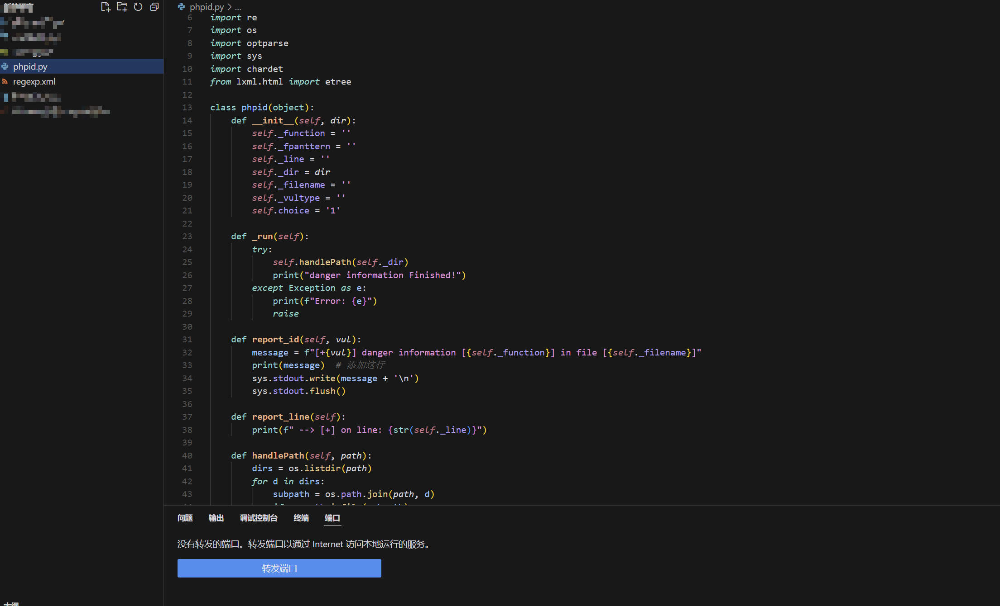
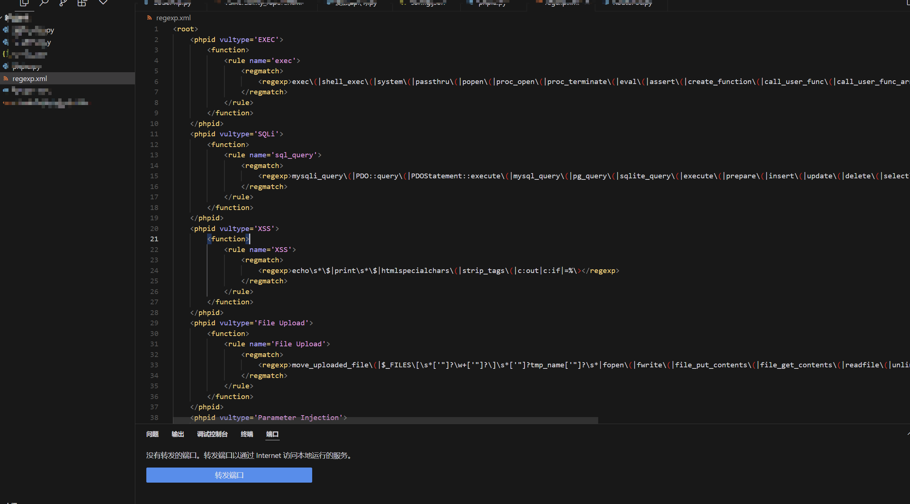
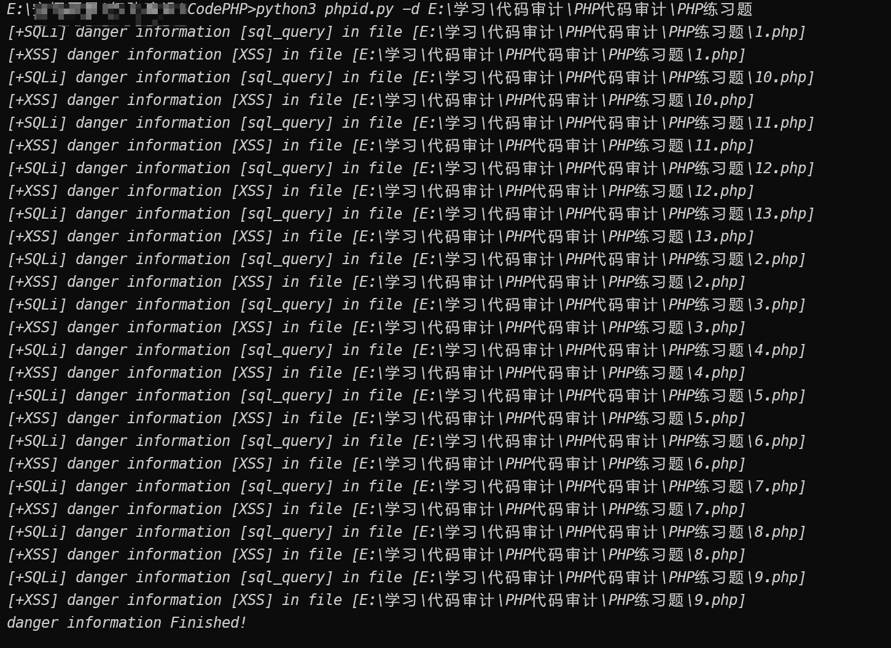
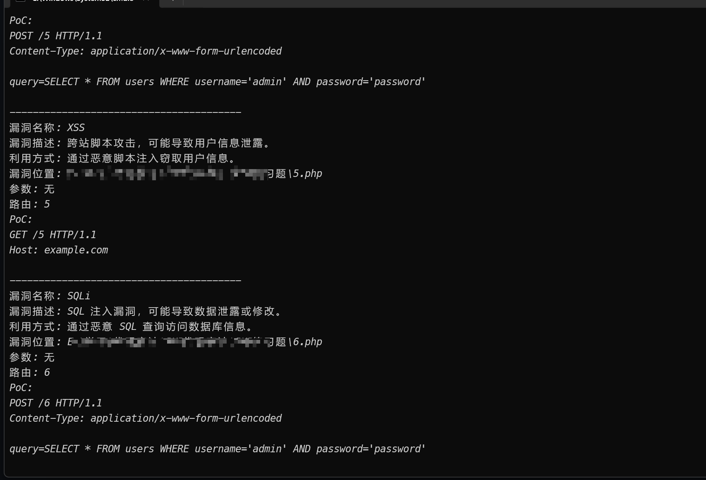
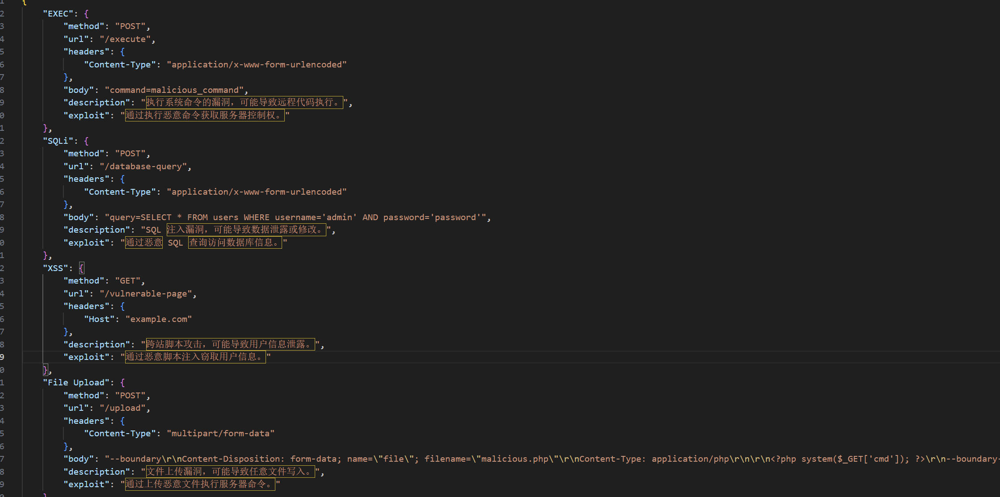
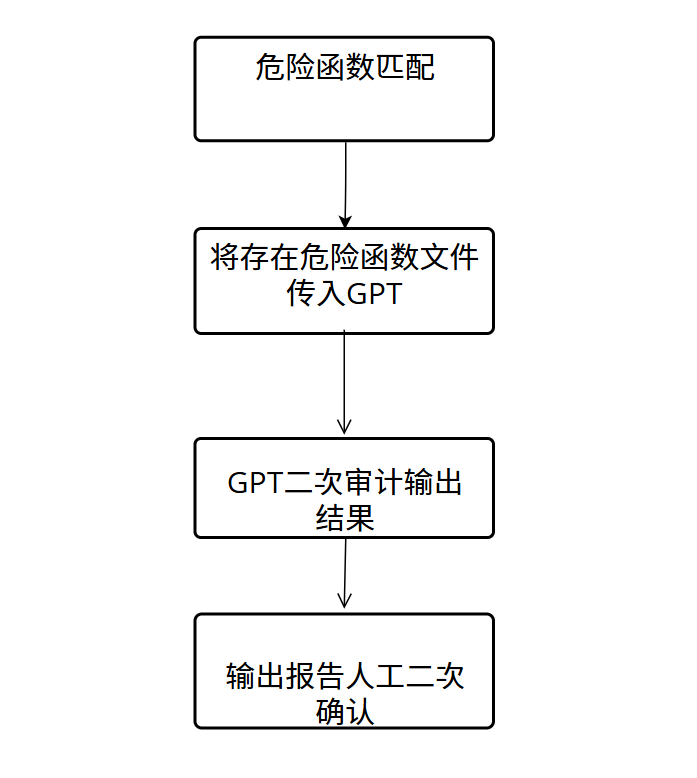
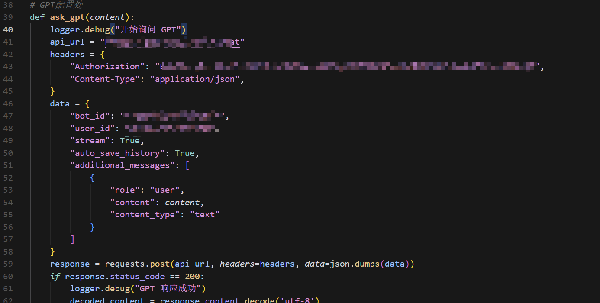
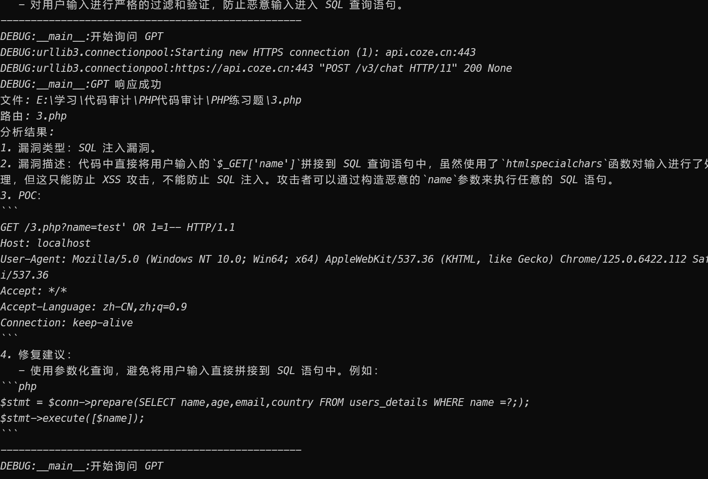
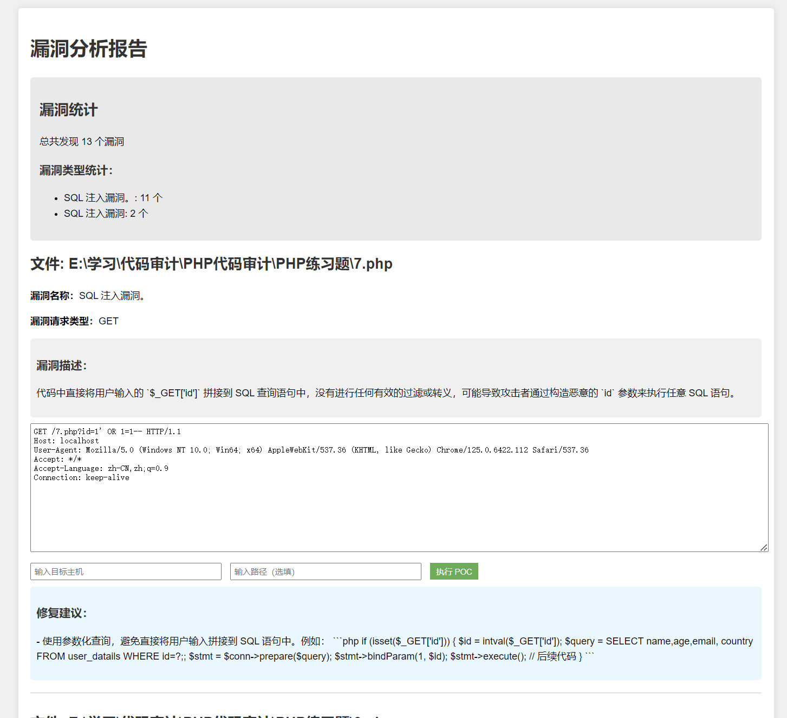

# CodeAi-PHP

一、介绍

CodeAi-PHP是一款基于Ai的代码审计辅助脚本，记住是辅助而不是完全替代，CodeAi-PHP从最开始的研发到现在可能有好一段时间（间断式研发，因为懒）CodeAi-PHP的前身为Javaid(一款开源脚本)变形的脚本，后更名为PHPid，CodeAi-PHP从最开始的PHPid==》==CodePHP==》CodeAi-PHP一共迭代了三个版本，每次更新当然都是一次较大的改革，当然后面也会继续更，看时间吧==

‍

二、版本介绍

前身笔祖就不再过多介绍了，感兴趣的同学可以自行去Github查看，首先是PHPid 基于正则规则匹配危险函数实现的一个半自动代码审计(辅助为主)

1、PHPid

文件结构为

主体的PHPid

​​

以及正则匹配文件regexp.xml

​​

能扫出来什么样的东西也取决于你正则怎么写

效果如下(其它漏洞也可以我没写示例的文件)

​​

2、CodePHP

更新至这个版本，主要是添加了参数提取、POC生成、路由匹配（不准）等功能

新增config.json、RoutePOC.py等文件，效果如下

​​

对小白更为友好，但是需要提前将POC格式写到config.json中

​​

当然这个版本问题也很多并没有怎么去修复

3、CodeAi-PHP

到目前最新的版本，本来想着写完到支持所有语言后再发布，但是考虑到后期部分工作比较难进行，再加上时间成本较高，就先把PHP的发出来，后续也希望大家测试过程中有好的修改意见及时反馈

CodeAi-PHP沿用最初版本的规则，舍弃2.0中的config.json RoutePoc.py等文件，仅保留了phpid以及regxep.xml

整体的实现过程为  
​​

需修改文件内容

​​

我是调的扣子的api如果有其它需求的可以自行更换，当然代码中提取路由一块的功能并不完善，需要自行去修改

输出示例

​​

输出报告示例

​​

填写主机和路径可以直接执行给的POC、POC的执行框也支持修改

工具运行方式python CodeAi-PHP 路径

到此工具介绍就全部结束了，也希望各位使用中发现任何问题及时反馈，有好的修改建议也希望及时联系我。
